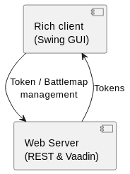

# Architecture

## Building Block View

### Module Diagram Level 0

#### Rich Client

* Master data management.
* Battle map management.
* Battle map builder.
* Game master view.
* Local player viewer.

#### Web Server

* Web player view.
* Storage for tokens with game stats.