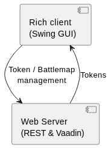
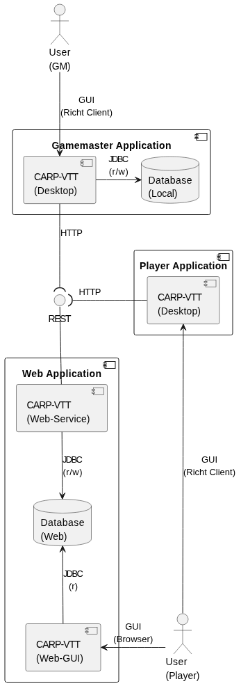

# Architecture

## Building Block View

### Module Diagram Level 0

#### Rich Clients

##### Gamemaster Application

* Master data management.
* Battle map management.
* Battle map builder.
* Game master view.
* Database.

##### Player Application

* Local player viewer.

#### Web Server

* Web player view.
* Storage for tokens with game stats (copy - original data are stored locally).

### Component Diagram Level 1

#### Gamemaster Application

* Master data maintenance.
* Has the database with the master data of the gamemaster.
* Session management.

#### Player Application

* Session management for player characters:
    * Battle map view.
    * Current markers, TP and so on.

#### Web Application

* Battle map view.
* Database with copy of the necessary data of the gamemaster database (multi-tenant):
    * Current markers, TP and so on for the player characters.
    * Session data for battle maps.
    * Tokens and battle maps.